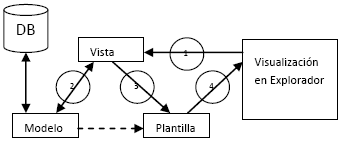
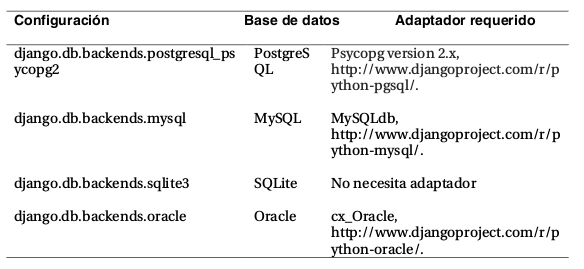
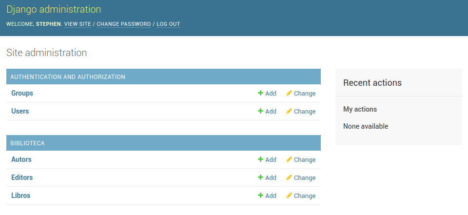

# Django

[TOC]

## Modelos de Django

El modelo es la capa de acceso a la base de datos. Esta capa contiene toda la información sobre los datos: cómo acceder a estos, cómo validarlos, cuál es el comportamiento que tiene, y las relaciones entre los
datos.



### Object-Relational Mapper (ORM)

El ORM es una técnica de programación para convertir datos entre sistemas de tipos incompatibles utilizando lenguajes de programación orientados a objetos.

### El ORM en Django

Django utiliza su propia implementación del ORM y gracias a esto podemos utilizar el manejador de base de datos de nuestra preferencia, sin importar cuál sea. 

ORM se puede usar para interactuar con datos de aplicaciones de varias bases de datos relacionales como SQLite, PostgreSQL y MySQL.

Esto se debe a que no estamos interactuando directamente con las instrucciones ni tipos de datos de un manejador de base de datos, en lugar de ello estamos trabajando con clases y atributos de clase.

#### Ejemplo

Por ejemplo, imaginemos que deseamos construir una agenda de direcciones, la aplicación tendría que tener una base de datos que tuviera una tabla llamada "personas" o algo similar.

Los campos de la tabla podrían ser

* nombre de la persona
* cero o más numeros de teléfono
* cero o más direcciones

Usando ORM podría modelarse en una implementación orientada a objetos mediante un "Objeto de persona" con atributos / campos para contener cada elemento de datos que comprende la entrada: el nombre de la persona, una lista de números de teléfono y una lista de direcciones.

``` python
class Persona 
	nombre = ''
    telefonos = []
    direcciones = []
	def Persona (self,nombre,telefonos,direcciones)
    	self.nombre = nombre
        self.telefonos = telefonos
        self.direcciones = direcciones  

```

## Guia para crear un Modelo

Antes de iniciar con las configuraciones de Django es necesario aclarar que previamente se tuvo que haber activado y configurado un servidor de base de datos y posteriormente haber creado una base de datos.

El primer ejemplo se hará con sqlite3 que viene incluido con django por lo que no hay que configurar nada.

### Configurando archivos

Necesitamos indicarle a Django qué servidor de base de datos usar y cómo conectarse al mismo

Editar el archivo `settings.py` y hallar la sección correspondiente a `DATABASES`, el cual es un diccionario que contiene los ajustes necesarios, para configurar la base datos:

```python
ENGINE = '' 
NAME = '' 
USER = '' 
PASSWORD = '' 
HOST = '' 
DATABASE_PORT = '' 
```

* **ENGINE**: le indica a Django qué base de datos utilizar. Si usas una base de datos con Django, ENGINE debe configurarse con una cadena de los mostrados en la Tabla de abajo.



* **NAME**  indica a Django el nombre de tu base de datos. Si estás usando SQLite, especifica la ruta completo del sistema de archivos hacia el archivo de la base de datos (por ej. '/home/django/datos.db').

* **USER** le indica a Django cual es el nombre de usuario a usar cuando se conecte con tu base de datos. Si estás usando SQLite, deja este en blanco.

* **PASSWORD** le indica a Django cual es la contraseña a utilizar cuando se conecte con tu base de datos. Si estás utilizando SQLite o tienes una contraseña vacía, deja este en blanco.

* **HOST** le indica a Django cual es el host a usar cuando se conecta a tu base de datos. Si tu base de datos está sobre la misma computadora que la instalación de Django (o sea localhost), deja este en blanco. Si estás usando SQLite, deja este en blanco.
* **PORT**  le indica a Django qué puerto usar cuando se conecte a la base de datos. Si estás utilizando SQLite, deja este en blanco. En otro caso, si dejas este en blanco, el adaptador de base de datos subyacente usará el puerto por omisión acorde al servidor de base de datos.

### Creación de un aplicación

Si estás usando la capa de base de datos de Django (modelos), debes crear una aplicación de Django. Los modelos deben vivir dentro de aplicaciones.

#### Diferencia entre un proyecto y una aplicación

* Un proyecto es una instancia de un cierto conjunto de aplicaciones de Django, más las configuraciones de esas aplicaciones. Técnicamente, el único requerimiento de un proyecto es que este suministre un archivo de configuración o settings.py, el cual define la información hacia la conexión a la base de datos, la lista de las aplicaciones instaladas, y así sucesivamente.
* Una aplicación es un conjunto portable de alguna funcionalidad de Django,típicamente incluye modelos y vistas, que conviven en un solo paquete de Python (Aunque el único requerimiento es que contenga una archivo models.py).

Para crear un aplicación debemos estar dentro del directorio del proyecto. Es decir, a la misma altura de donde se ubica `manage.py` 

Para crear el proyecto escribimos `python3 manage.py startapp nombre_de_app`

Ahora tenemos un directorio más, el cual tiene el nombre de nuestra aplicación y una estructura similar a

```none
nombre_de_app/ 
    __init__.py 
    admin.py 
    models.py 
    tests.py 
    views.py 
    migrations/ 
        __init__.py 
```

Lo siguiente que debemos hacer es "dar de alta nuestra aplicación", es decir, debemos informar al django que deseamos usar nuestra aplicación en el proyecto, esto se logra editando `settings.py`

#### INSTALLED_APPS

En el apartado de `INSTALLED_APPS`

Debe verse de la siguiente manera

```python
INSTALLED_APPS = ( 
    'django.contrib.admin', 
    'django.contrib.auth', 
    'django.contrib.contenttypes', 
    'django.contrib.sessions', 
    'django.contrib.messages', 
    'django.contrib.staticfiles', 
    'biblioteca',  
)
```

Notesé que el último elemento lo hemos agregado nosotros y se llama bibloteca que es el nombre nuestra aplicación

**No olvides la coma al final**

## Creación de un modelo

### Ejemplo modelo Biblioteca

Crearemos una configuración de datos básica sobre libro/autor/editor (una biblioteca).

Es momento de usar el ORM, es decir, de empezar a modelar nuestras tablas como objectos.

#### models.py

En el archivo `models.py` de la aplicación comenzaremos a contruir nuestros modelos, quedará de la siguiente manera.

```python
from django.db import models 
 
class Editor(models.Model): 
    nombre = models.CharField(max_length=30) 
    domicilio = models.CharField(max_length=50) 
    ciudad = models.CharField(max_length=60) 
    estado = models.CharField(max_length=30) 
    pais = models.CharField(max_length=50) 
    website = models.URLField() 
    
    def __str__(self): # __unicode__ en Python 2 
        return self.nombre 
 
class Autor(models.Model): 
    nombre = models.CharField(max_length=30) 
    apellidos = models.CharField(max_length=40) 
    email = models.EmailField() 
    
    def __str__(self): # __unicode__ en Python 2 
       return '%s %s' % (self.nombre, self.apellidos) 
class Libro(models.Model): 
    titulo = models.CharField(max_length=100) 
    autores = models.ManyToManyField(Autor) 
    editor = models.ForeignKey(Editor,on_delete=models.CASCADE) 
    fecha_publicacion = models.DateField() 
    portada = models.ImageField(upload_to='portadas')   
    
    def __str__(self): # __unicode__ en Python 2 
        return self.titulo 
```

La excepción a la regla una-clase-por-tabla es el caso de las relaciones muchos-a-muchos. En nuestros modelos de ejemplo, libro tiene un ManyToManyField llamado autor. Esto significa que un libro tiene uno o más autores, pero la tabla de la base de datos libro no tiene una columna autores. En su lugar, Django crea una tabla adicional --- una ‘‘tabla de join’’ muchos-a-muchos --- que maneja la correlación entre biblioteca y autores.

#### manage.py check

Utiliza el framework de verificación del sistema para inspeccionar todo el proyecto de Django en busca de problemas comunes. El marco de verificación del sistema confirmará que no hay ningún problema con sus modelos instalados o sus registros administrativos.

`python3 manage.py check`

#### manage.py makemigrations

Una vez que todo está en orden, necesitamos guardar las migraciones para los modelos en un archivo de control, para que Django pueda encontrarlas al sincronizar el esquema de la base de datos.

`python manage.py makemigrations `

Lo que hace este comando es crear sentencias sql

#### manage.py sqlmigrate app migration_number

Es posible ver el código SQL que genero makemigrations a través de la siguiente instrucción

`python manage.py sqlmigrate biblioteca 0001`

Observa lo siguiente:

* Los nombres de tabla se generan automáticamente combinando el nombre de la aplicación (biblioteca) y el nombre en minúsculas del modelo (Editor,Libro, y Autor). 

* Django agrega una clave primaria para cada tabla automáticamente --- los campos id. También puedes sobrescribir esto.

* Por convención, Django agrega "_id" al nombre de campo de las claves foráneas. Como ya puedes imaginar, también puedes sobrescribir esto.

* La relación de clave foránea se hace explícita con una sentencia REFERENCES

* Estas sentencias CREATE TABLE son adaptadas a medida de la base de datos que estás usando, de manera que Django maneja automáticamente los tipos de campo específicos de cada base de datos, como auto_increment (MySQL), serial (PostgreSQL), o integer primary key (SQLite), por ti. Lo mismo sucede con el uso de las comillas simples o dobles en los nombres de columna. La salida del ejemplo está en la sintaxis de PostgreSQL.

#### Migraciones

Las migraciones son la forma en que Django se encarga de guardar los cambios que realizamos a los
modelos (Agregando un campo, una tabla o borrando un modelo... etc.) en el esquema de la base de datos. Están diseñadas para funcionar en su mayor parte de forma automática, utilizan un controlador de  versiones para almacenar los cambios realizados a los modelos y son guardadas en un archivo del disco llamado ‘‘migration files’’, que no es otra cosa más que archivos Python, por lo que están disponibles en
cualquier momento.

#### manage.py migrate 

Una vez creado las migraciones con makemigrations, es necesario sincronizar los cambios en la base de datos ya que el comando sqlmigrate no crea ni toca de ninguna forma tu base de datos --- sólo imprime una salida en la pantalla para que puedas ver qué SQL.

Ahora para realizar los cambios al esquema de la base de datos es necesario usar el comando mígrate, que se encarga de crear las tablas de la base de datos:
`python manage.py migrate `

Este comando examina todos los modelos en cada aplicación que figure en tu variable de configuración INSTALLED_APPS, verifica la base de datos para ver si las tablas apropiadas ya existen, y las crea si no existen.

## Acceso básico a datos (QuerySet)

A continuación se muestran 2 maneras de ingresar y modificar nuestros datos, existe un tercera manera que es mediante la *Administración de Django* que es una interfaz que nos proporciona la interfaz.

### QuerySets

Un QuerySet representa una colección de objetos de su base de datos. Un QuerySet te permite leer los datos de una base de datos, filtrarlos y ordenarlos.

### Accediendo a los datos mediante la shell

> Es importante saber que django tiene una shell, es la shell de python pero ya tiene muchas cosas importadas que nos sirven para hacer pruebas de alguna función de un determinado módulo.
>
> Dicho shell se abre de la siguiente manera.
>
> `python3 manage.py shell`

Abriremos la shell de python y empezaremos a probar las siguiente operaciones en nuestra base de datos **biblioteca**.

No ovide importar el modelo a utilizar.

`from biblioteca.models import Editor`

#### Insertar datos

Para poder insertar datos primero debemos crear un objeto de la clase correspondiente a la tabla donde quereremos insertar nuestros datos. En nuestro ejemplo la tabla es Editor, entonces se crea un objeto de tip editor. Y en el mismo constructor es posible ingresar información, de la siguiente manera.

```python
>>> p1 = Editor(nombre='Addison­Wesley', domicilio='75 Arlington Street', 
...     ciudad='Boston', estado='MA', pais='U.S.A.', 
...     website='http://www.apress.com/')
```

También es posible llenar campo por cambio de la siguiente manera

```python
>>> p1 = Editor()
>>> p2.nombre = 'saul'
```

#### Guardar registro

Hasta el momento no se ha guardardo datos en la base, simplemente hemos creado objetos, para guardar los cambios debemos ejecutar el siguiente método.

```python
>>> p1.save()
```

#### Insertar y guardar al mismo tiempo

#### Actualizar datos

Para actualizar datos simplemente basta con tener un objecto al que se le quieran actualizar los datos, sigamos los siguientes pasos.

* Imprimir el campo que se desea actualizar antes de actualizarlo
* Actualizar el dato 
* Guardar el dato
* Volver a imprimir el campo para comprobar los cambios

```python
>>> p1.nombre
>>> p1.nombre = 'nuevo_nombre'
>>> p1.save()
>>> p1.nombre
```

#### Eliminar un registro

```python
>>> p1.delete()
```

#### Listar registros

```python
>>> Lista_Editores = Editor.objects.all() 
>>> Lista_Editores 
[<Editor: Editor object>, <Editor: Editor object>] 
```

#### id

`p.id `

#### Filtrar datos

Es importante saber que los filtros regresean un QuerySet, es decir, un diccionario.

```python
>>> Editor.objects.filter(nombre="Apress Publishing") 
```

Es importante saber que dependiendo de las coincidencias puede arrojar más de una.

> Además, a este QuerySet se le puede volver a aplicar un filtro

#### Filtros múltiples

```python
>>> Editor.objects.filter(ciudad="Berkeley", estado="CA") 
```

Estos filtros son traducidos a cláusulas SQL AND

#### Mirar el contenido del filtro

```python
>>> Editor.objects.filter(nombre="Apress Publishing").values()
```

#### Values (... )

```python
>>>Editor.objects.filter(nombre="Apress Publishing").values('ciudad')
```

#### Filtros que regresan objectos

```python
>>> Editor.objects.get(nombre="Apress Publishing") 
```

¡Cuidado! Sí existen más de una coincidencia o ninguna se genera un excepción.

#### Ordenar datos

```python
>>> Editor.objects.order_by("nombre") 
```

#### Orden múltiple

Para ordenar por múltiples campos (donde el segundo campo es usado para quitar las ambigüedades en el orden, en casos donde el nombre sea el mismo), puedes usar múltiples argumentos:

```python
 >>> Editor.objects.order_by("estado", "domicilio") 
```

#### Orden inverso

También podemos especificar un ordenamiento inverso antecediendo al nombre del campo un prefijo - (el símbolo menos).

```python
>>> Editor.objects.order_by("­nombre") 
```

#### Orden en la clase

Django permite orden por defecto los elementos, ya que La mayor parte del tiempo tendrás un campo en particular por el que usualmente desearás ordenar tus datos.

```python
class Editor(models.Model): 
    nombre = models.CharField(max_length=30) 
    domicilio = models.CharField(max_length=50) 
    ciudad = models.CharField(max_length=60) 
    estado = models.CharField(max_length=30) 
    pais = models.CharField(max_length=50) 
    website = models.URLField() 
 
   class Meta: 
        ordering = ["nombre"] 
 
    def __str__(self): 
        return self.nombre 
```

#### Encadenar búsquedas

```python
Editor.objects.filter(pais="U.S.A.").order_by("­nombre") 
```

#### Update

```python
>>> Editor.objects.filter(id=1).update(nombre='Apress Publishing') 
```

#### Rebanar datos

Otra necesidad común es buscar sólo un número fijo de filas.

* Mostrar solo el primer registro de todos.

  * ```python
    Editor.objects.all()[0] 
    ```

* Mostrar un rango de datos.

  * ```python
    >>> Editor.objects.order_by('nombre')[0:2] 
    ```

* Observa que el rebanado negativo no está soportado, sin embargo, esto se puede solucionar fácilmente de la siguiente manera.

  * ```python
    >>> Editor.objects.order_by('-nombre')[0]
    ```

#### Borrar todos los registros

```python
>>> Editor.objects.all().delete() 
```

### Accediendo a los datos a través de vistas

## Administración de Django

### Activar interfaz administrativa

Casi siempre viene activada, pero podemos comprobarlo en setting.py

Deberemos ver las siguientes aplicaciones en la sección de `INSTALLED_APPS`

```python
django.contrib.auth 
django.contrib.contenttypes 
django.contrib.messages 
django.contrib.sessions 
```

Ahora debemos actualizar las tablas de las bases de datos necesarioas para que la interfaz pueda funcionar. Utilizamos 

`python manage.py migrate `

Para usar el administrador de Django debemos asegurarnos de tener un super usuario y su contraseña para poder ingresar a la interfaz.

### Super usuario

El super usuario puede ser creado mediante el siguiente comando

`python3 manage.py createsuperuser`

Nos pedirá un usuario, una contraseña y un email.

### Agregar URL

Una vez creadas las tablas, solo necesitas agregar el patrón URL al archivo urls.py. Si aún estás usando el que fue creado por startproject, el patrón de la URL de administración ya debería estar ahí, pero  comentado.

En todo caso debería verse así. 

```python
from django.conf.urls import url 
from django.contrib import admin 
 
urlpatterns =[ 
     url(r'^admin/', include('django.contrib.admin.urls')), 
] 
```

### Agregar nuestros modelos a la interfaz de adminstración

Si iniciamos el servidor y accedemos al sitio de administrador mediante

`http://[dir_ip]:8000/admin`

Veremos que solo podemos agregar usuarios y grupos de django, para agregar nuestros modelos hacemos lo siguiente.

Dentro del directorio interno biblioteca (misitio/biblioteca), existe un archivo vacio llamado admin.py, creado automáticamente por el comando startapp agreguémosle las siguientes líneas de código, para registrar nuestros tres modelos:

```python
from django.contrib import admin 
from biblioteca.models import Editor, Autor, Libro 
 
admin.site.register(Editor) 
admin.site.register(Autor) 
admin.site.register(Libro) 
```

Después de reiniciar el servidor o simplemente de actualizar la página de administración, debemos ver lo siguiente.



## Bibliografía

https://tutorial.djangogirls.org/es/django_admin/

https://www.tutorialspoint.com/django/django_models.htm

http://timsaylor.com/convert-django-model-instances-to-dictionaries

http://www.tangowithdjango.com/book/chapters/models_templates.html